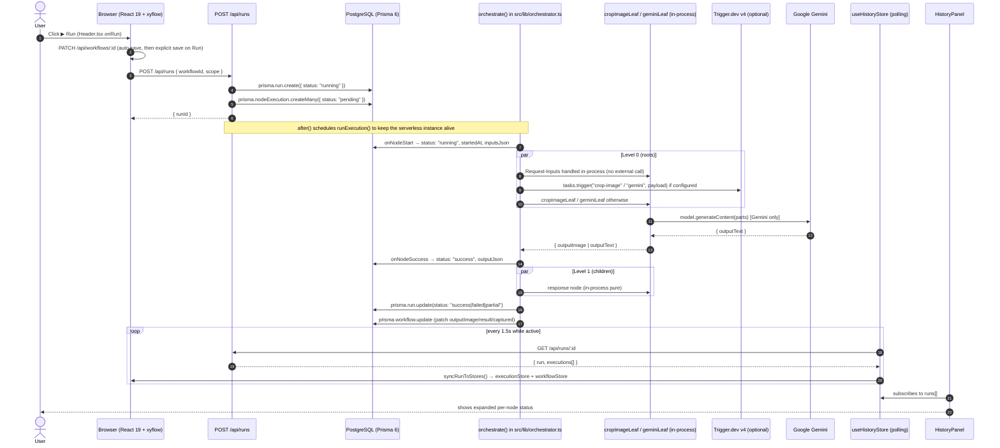
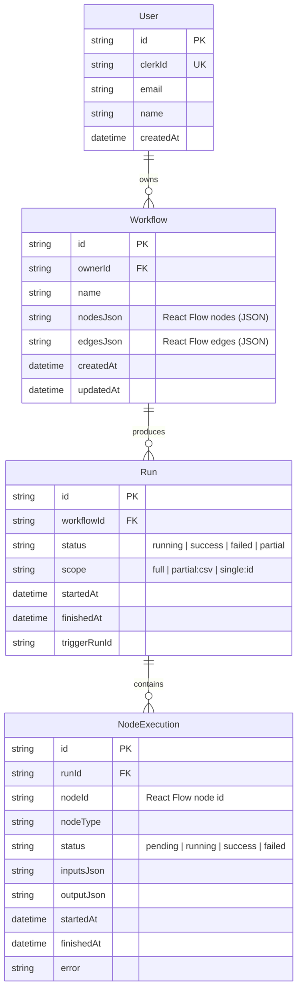
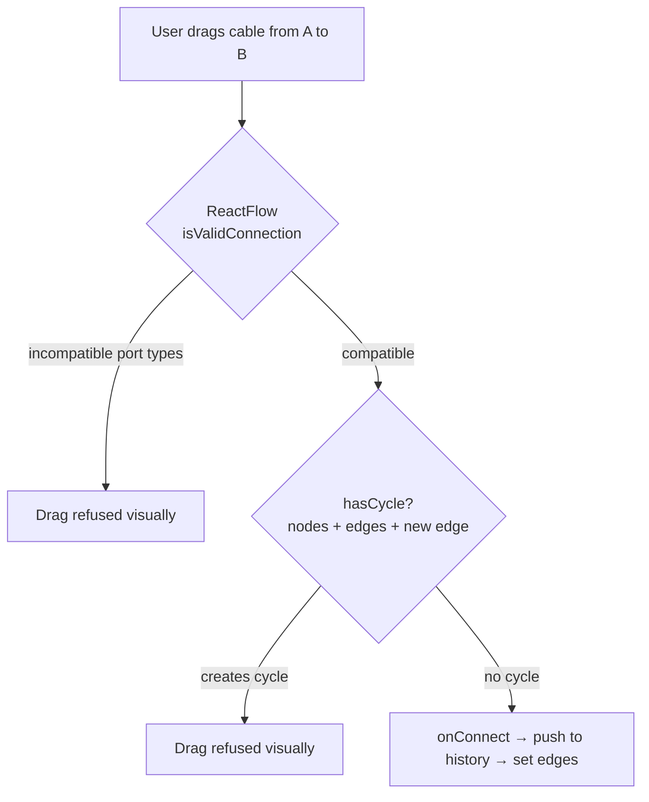
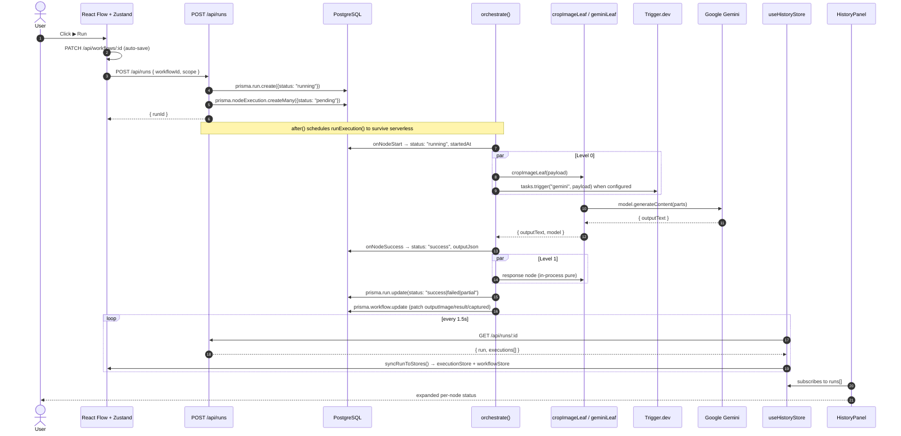
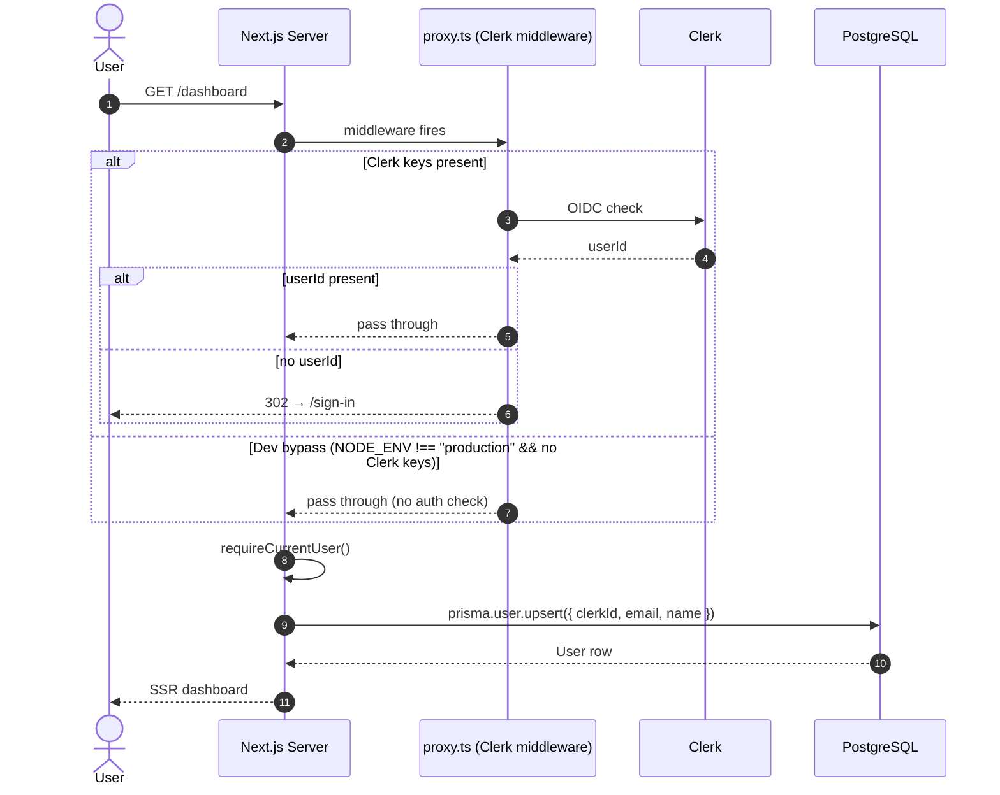
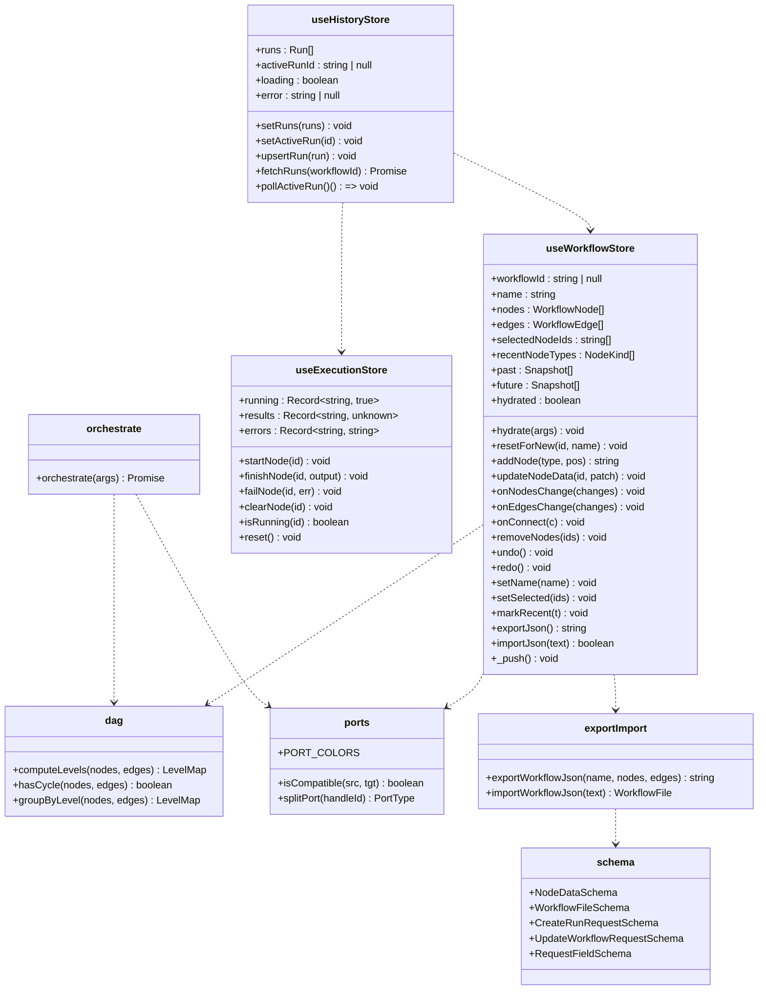
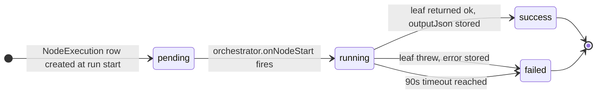
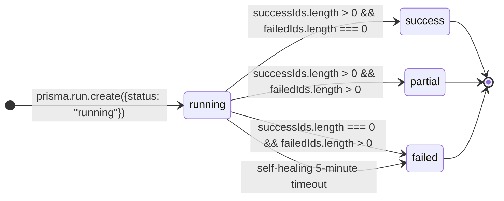
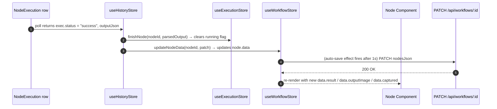

# NextFlow 🌌

> A pixel-perfect, premium LLM workflow builder inspired by Galaxy.ai — visually compose, connect, and execute multimodal AI workflows that combine custom image cropping and Google Gemini tasks.

> **⚠ This is NOT the Next.js you know.** This project is built on **Next.js 16** (App Router), **React 19**, **Trigger.dev v4**, **@xyflow/react v12**, **Clerk v7**, **Zod v4**, **Tailwind v4**, and **Prisma 6** against a serverless **Neon PostgreSQL**. All of these versions ship with breaking changes versus what most model training data knows. Read `AGENTS.md` before contributing.

This README is written in **two layers at every section**: a **plain-English** layer (analogies, story-style language, for non-engineers) and a **technical** layer (real function/file names, types, complexity, design decisions, for senior engineers). Read at whatever depth you need.

---

## Table of Contents

1. [What is NextFlow?](#1-what-is-nextflow)
2. [The Two-Audience Reading Guide](#2-the-two-audience-reading-guide)
3. [Quick Start](#3-quick-start)
4. [Full Directory Map (annotated)](#4-full-directory-map-annotated)
5. [The Big Picture — How a Run Flows](#5-the-big-picture--how-a-run-flows)
6. [The Data Model (Prisma)](#6-the-data-model-prisma)
7. [The Port Type System — How Cables Know Their Shape](#7-the-port-type-system--how-cables-know-their-shape)
8. [The Workflow Store — the Brain of the Canvas](#8-the-workflow-store--the-brain-of-the-canvas)
9. [The Other Two Stores (Execution + History)](#9-the-other-two-stores-execution--history)
10. [The Orchestrator — the Engine](#10-the-orchestrator--the-engine)
11. [The React Flow Layer](#11-the-react-flow-layer)
12. [The Four Node Implementations](#12-the-four-node-implementations)
13. [The Two Trigger.dev Tracks (In-Process + Deployed)](#13-the-two-triggerdev-tracks-in-process--deployed)
14. [The API Surface](#14-the-api-surface)
15. [Authentication — Clerk, with a Dev Escape Hatch](#15-authentication--clerk-with-a-dev-escape-hatch)
16. [File Uploads via Transloadit](#16-file-uploads-via-transloadit)
17. [Zod Schema Layer — Every API Boundary Is Validated](#17-zod-schema-layer--every-api-boundary-is-validated)
18. [The Polling Model — Why No WebSockets?](#18-the-polling-model--why-no-websockets)
19. [The Mandatory 30s Crop Delay — and Why It Isn't Here](#19-the-mandatory-30s-crop-delay--and-why-it-isnt-here)
20. [Environment Variables Cheat Sheet](#20-environment-variables-cheat-sheet)
21. [How the Pieces Talk — A Component Map](#21-how-the-pieces-talk--a-component-map)
22. [Class Diagram of the Stores](#22-class-diagram-of-the-stores)
23. [State Machines for Runs and Executions](#23-state-machines-for-runs-and-executions)
24. [The "Live Patch" Loop — How Results Stream In](#24-the-live-patch-loop--how-results-stream-in)
25. [Failure Modes & Defensive Behaviour](#25-failure-modes--defensive-behaviour)
26. [Inconsistencies, Tech Debt, and Things to Watch](#26-inconsistencies-tech-debt-and-things-to-watch)
27. [Glossary (Plain English)](#27-glossary-plain-english)
28. [TL;DR for the New Joiner](#28-tldr-for-the-new-joiner)

---

## 1. What is NextFlow?

### Plain English

Imagine a **piece of paper on a wall** where you pin little **sticky notes** (called *nodes*) and connect them with **coloured strings** (called *edges*). Each sticky note represents one small job — "ask the AI this question", "cut this picture in half", "remember what the user typed". When you press a big **Play** button at the top, the strings start glowing and the sticky notes blink in order, top-to-bottom, left-to-right. Each note that finishes **lights up green** and passes its answer down the string to the next note. The last sticky note — the **Response** — writes the final answer onto a little card for you to read.

That's NextFlow. It's a **draw-your-own-pipeline** app for AI workflows.

It is most useful when:
- You want to **prototype an AI pipeline visually** rather than write glue code.
- You have a small library of operations (image cropping, calling Google's Gemini AI, capturing user input) and you want to wire them up **without code**.
- You want to see, in real time, **which step is currently working and which one broke**.

### Technical

NextFlow is a **single-page full-stack Next.js 16 application** that lets a user build a typed, directed acyclic graph (DAG) of "nodes" on a React Flow canvas. Each node declares **typed I/O handles** (`text`, `image`, `video`, `audio`, `file`, `number`) and represents a unit of work. The system supports four node kinds today:

- `requestInputs` — collects user-supplied text and image fields; pure (no I/O).
- `cropImage` — takes an image and percent coordinates `x/y/w/h`, runs ffmpeg to crop, returns a base64 PNG.
- `gemini` — calls `gemini-2.5-flash` (free-tier) via `@google/generative-ai` with prompt + optional system + optional image/video/audio/file attachments.
- `response` — sink; picks the first non-empty text from its inputs and displays it.

Edges are typed and validated twice (React Flow's `isValidConnection` and the store's `onConnect`). Cycles are rejected. The full graph is serialised to JSON and persisted in a `Workflow` row in PostgreSQL via Prisma 6.

The execution model is a **dynamic Kahn's algorithm with eager fan-out** in `src/lib/orchestrator.ts`. Per-node `NodeExecution` rows are persisted; the browser polls `GET /api/runs/[id]` every 1.5 s to surface status and stream results back into the canvas. Dispatch is either to a **Trigger.dev v4 background task** (`@trigger.dev/sdk` v4) or to an **in-process leaf** (`src/lib/trigger-tasks/*`) when Trigger is not configured. The whole thing **degrades gracefully** if Clerk, Trigger, Transloadit, or Gemini keys are missing.

---

## 2. The Two-Audience Reading Guide

### Plain English

Two people are reading this: a **PM** who has never coded, and a **senior engineer** joining the team. Each section has the same information, told twice:

- The first layer uses real-world analogies. Imagine a kitchen, an office, a factory. Don't worry if you don't recognise words like "Zustand" or "Prisma" — those are explained in the **Glossary** at the end.
- The second layer uses precise terms. If you're a new engineer, **read the plain layer first**, then the technical layer — they'll reinforce each other.

### Technical

The document is structured so that a reader can skim the plain layer for product intuition, then re-read the same section for the engineering contract. Every code reference (file path, function name, type, Zod schema, store action) is a **real one** verified against the source. Diagrams use **Mermaid** with the right diagram type per concept. Code blocks include enough surrounding context to be unambiguous.

---

## 3. Quick Start

### Plain English

```bash
# 1. Install dependencies
npm install

# 2. Create a local env file (it has the keys the app needs)
cp .env.example .env.local
# …open .env.local and fill in at least DATABASE_URL

# 3. Push the database schema (creates the four tables)
npx prisma db push
npx prisma generate

# 4. Start the app
npm run dev
# Open http://localhost:3000 in your browser
```

If you don't have a Clerk account, the app **runs anyway in demo mode** with a fake local user. If you don't have a Gemini key, the AI responses are **friendly mocks** that show what *would* have been sent. If you don't have Trigger.dev, the orchestrator runs the steps **directly on the Next.js server** instead of background workers. If you don't have Transloadit, file uploads are **stored as base64 data URLs** in the field.

### Technical

```bash
git clone <repo>
cd galaxy
npm install
cp .env.example .env.local       # then edit
npx prisma db push                # creates the 4 tables
npx prisma generate
npm run dev                       # → http://localhost:3000
```

Optional Trigger.dev worker (only if you want the queued, retryable execution track):

```bash
NEXTFLOW_USE_TRIGGER=true npx trigger.dev@latest dev
```

When `NEXTFLOW_USE_TRIGGER` is not `"true"` (or the keys are missing), the orchestrator in `src/lib/orchestrator.ts` calls the in-process leaves in `src/lib/trigger-tasks/*` directly via `Promise.race` with a 90 s safety timeout. Both leaves honour `CROP_FAKE_DELAY_MS` to make local iteration fast.

---

## 4. Full Directory Map (annotated)

### Plain English

Think of the project as a **kitchen** with these rooms:

| Room | What's inside | Who uses it |
|---|---|---|
| `src/app/` | The front-of-house — what the browser sees | The user |
| `src/app/api/` | The waiter stations — taking orders, returning food | The browser |
| `src/lib/` | The kitchen — the recipes and the pantry | The waiter stations |
| `src/store/` | The clipboard and chalkboards the chefs share | The kitchen (React side) |
| `prisma/` | The cellar — where the food is stored long-term | The kitchen |
| `trigger/jobs/` | The prep station — bulk-cooked food you can summon later | Trigger.dev workers |
| `public/` | The restaurant décor | The user |
| Config files (top level) | The restaurant's business license and operating manual | The owner |

### Technical

```
galaxy/
├── AGENTS.md                          # "This is NOT the Next.js you know" (read first)
├── CLAUDE.md                          # Re-exports AGENTS.md
├── README.md                          # This file
├── package.json                       # Next 16.2.9, React 19.2, Prisma 6, Trigger 4, Zod 4, xyflow 12, Zustand 5
├── tsconfig.json                      # strict, noUncheckedIndexedAccess, @/* → src/*
├── next.config.ts                     # allowedDevOrigins: 127.0.0.1 / localhost
├── postcss.config.mjs                 # Tailwind v4 PostCSS plugin
├── eslint.config.mjs                  # next/core-web-vitals + next/typescript
├── next-env.d.ts                      # auto-generated Next type references
├── .env / .env.local / .env.example   # Database, Clerk, Trigger, Transloadit, Gemini keys
├── .neon                              # Neon init flag (skills-lock database feature)
├── skills-lock.json                   # Pinned agent skills (neon + neon-postgres)
├── .trigger-config.patch              # Local patch notes
│
├── prisma/
│   └── schema.prisma                  # 4 models: User, Workflow, Run, NodeExecution
│
├── trigger/                           # Trigger.dev v4 task directory (deployable)
│   ├── trigger.config.ts              # Project, runtime, retries, maxDuration
│   └── jobs/
│       ├── index.ts                   # re-exports the 3 tasks
│       ├── crop-image.ts              # cropImageTask — ffmpeg crop on Trigger machine
│       ├── gemini.ts                  # geminiTask — Google Generative AI call
│       └── run-workflow.ts            # runWorkflowTask — level-by-level fan-out
│
├── public/                            # Static SVGs from the Next.js template
│   ├── file.svg / globe.svg / next.svg / vercel.svg / window.svg
│
└── src/
    ├── proxy.ts                       # Clerk middleware + local-demo bypass
    │
    ├── app/
    │   ├── layout.tsx                 # Root layout: Inter + Outfit fonts, ClerkProvider, Attribution, globals.css + xyflow CSS
    │   ├── page.tsx                   # Root redirect: /dashboard or /sign-in (with dev bypass)
    │   ├── globals.css                # Tailwind v4 + custom CSS for canvas, edges, glass UI, node cards
    │   ├── favicon.ico                # Browser tab icon
    │   │
    │   ├── sign-in/[[...sign-in]]/page.tsx   # Clerk <SignIn/> with custom appearance
    │   ├── sign-up/[[...sign-up]]/page.tsx   # Clerk <SignUp/> with custom appearance
    │   │
    │   ├── dashboard/
    │   │   ├── page.tsx               # Server component: SSR workflow list via Prisma
    │   │   └── _components/
    │   │       └── DashboardClient.tsx   # Client: create/rename/delete with optimistic UI
    │   │
    │   ├── workflow/[id]/
    │   │   ├── page.tsx               # Server: loads Workflow row, hands to CanvasShell
    │   │   └── _components/
    │   │       ├── CanvasShell.tsx           # Client: hydrates stores, lays out floating UI
    │   │       ├── WorkflowCanvas.tsx        # The <ReactFlow> root (nodes/edges/auto-save)
    │   │       ├── NodePicker.tsx            # "+" floating menu (LLM, Image, etc.)
    │   │       ├── Header.tsx                # Title, undo/redo, count, Play, History toggle, Stop
    │   │       ├── BottomToolbar.tsx         # Sidebar toggle, Export/Import, Undo/Redo, + Node
    │   │       ├── HistoryPanel.tsx          # Slide-in panel of past runs + per-node executions
    │   │       ├── GuidePanel.tsx            # 5-step builder guide with live progress
    │   │       ├── Sidebar.tsx               # Legacy dark sidebar kept as fallback
    │   │       ├── nodes/
    │   │       │   ├── RequestInputsNode.tsx # Text/image field list + Transloadit upload
    │   │       │   ├── CropImageNode.tsx     # x/y/w/h percent inputs, image preview
    │   │       │   ├── GeminiNode.tsx        # Model select, prompt, system, image/video/audio/file ports
    │   │       │   └── ResponseNode.tsx      # Final output sink + typing animation
    │   │       └── edges/
    │   │           ├── PurpleAnimatedEdge.tsx    # Legacy purple-only edge
    │   │           ├── ColoredAnimatedEdge.tsx   # Color-coded by port type (text/image/video/audio/file)
    │   │           └── UnifiedAnimatedEdge.tsx   # Current default — color + hover-delete X
    │   │
    │   └── api/
    │       ├── workflows/
    │       │   ├── route.ts            # GET (list with running flag) / POST (create)
    │       │   └── [id]/route.ts       # GET / PATCH / DELETE
    │       ├── runs/
    │       │   ├── route.ts            # POST (start + fire-and-forget orchestrate) / GET (list)
    │       │   └── [id]/route.ts       # GET (with self-healing 5-min timeout) / DELETE (stop)
    │       └── upload/route.ts         # POST → Transloadit signed assembly (or { fallback: true })
    │
    ├── components/
    │   └── Attribution.tsx             # Logs the candidate's LinkedIn URL once per page (client-only)
    │
    ├── lib/
    │   ├── auth.ts                     # Clerk → Prisma User upsert; local-demo bypass
    │   ├── attribution.ts              # Reads NEXTFLOW_CANDIDATE_LINKEDIN
    │   ├── cn.ts                       # Tiny classnames helper (no clsx dependency)
    │   ├── dag.ts                      # computeLevels, hasCycle, groupByLevel (Kahn's algorithm)
    │   ├── db.ts                       # PrismaClient singleton (dev-safe via globalThis)
    │   ├── exportImport.ts             # exportWorkflowJson / importWorkflowJson (Zod-validated)
    │   ├── orchestrator.ts             # The big one: topological fan-out + Trigger/in-process switch
    │   ├── ports.ts                    # PortType system + isCompatible + splitPort + NodeData union + RequestField
    │   ├── schema.ts                   # Zod schemas for every API boundary + export file format
    │   ├── transloadit.ts              # HMAC-SHA1 signed assembly params; isTransloaditConfigured
    │   └── trigger-tasks/
    │       ├── crop-image.ts           # In-process leaf: ffmpeg crop with passthrough fallback
    │       └── gemini.ts               # In-process leaf: multimodal Gemini call with mock fallback
    │
    ├── store/
    │   ├── useWorkflowStore.ts         # Zustand: nodes, edges, undo/redo, hydration, edge guards
    │   ├── useExecutionStore.ts        # Zustand: which nodes are running / their results / errors
    │   └── useHistoryStore.ts          # Zustand: runs, polling, syncs back into the other two stores
    │
    └── trigger/.gitkeep                # Placeholder (live tasks live in /trigger/jobs)
```

---

## 5. The Big Picture — How a Run Flows

### Plain English

Here's the whole journey from "I click Play" to "I see the answer", as a story:

1. You're looking at a paper on the wall with sticky notes and strings. You press **Play**.
2. The app **saves the picture** to a notebook (in case you crash). Then it **hands the paper to a chef** in the kitchen.
3. The chef **reads the picture** and groups the sticky notes into "rows" — each row can run at the same time as the others in that row. The first row is the start (what the user typed). The last row ends with the **Response** note.
4. For every note in row 1, the chef starts a **worker**. The workers run in parallel, like waiters in a restaurant all serving different tables. Each worker writes a small report on their note when done.
5. As soon as a worker finishes, the chef looks at which notes that note was connected to. For each of those "downstream" notes, the chef **decreases a counter**. When the counter hits zero (all its inputs are ready), that downstream note gets its own worker.
6. The Response note is special — when its worker finishes, the chef **writes the final answer on a card** you can read on the page.
7. Meanwhile, the page itself is **asking the kitchen every 1.5 seconds** "is it done yet?" As soon as each worker's report comes back, the page **lights up that sticky note green** and shows the result inside it.

### Technical



Three boundaries to keep in mind:

- **Browser ↔ Next.js Server**: plain JSON HTTP. **No websockets, no SSE** — the client **polls `GET /api/runs/[id]` every 1.5 s** while a run is active.
- **Orchestrator ↔ Trigger.dev**: optional. If `NEXTFLOW_USE_TRIGGER=true` *and* `TRIGGER_SECRET_KEY` *and* `TRIGGER_PROJECT_ID` are all set, the orchestrator uses `tasks.trigger` + `runs.poll`. Otherwise it calls the in-process leaves directly.
- **Orchestrator ↔ DB**: per-node writes happen through Prisma via the `onNodeStart`/`onNodeSuccess`/`onNodeFailure` callbacks supplied by the `/api/runs` route.

---

## 6. The Data Model (Prisma)

### Plain English

The app has four kinds of records stored in the database:

| Record | What it represents | Like a… |
|---|---|---|
| **User** | A person who can log in | A library card |
| **Workflow** | A paper on the wall — a saved graph | A saved document |
| **Run** | One execution of a workflow | A receipt for a coffee order |
| **NodeExecution** | What happened to one sticky note during one run | A line item on the receipt |

The app doesn't store the sticky notes individually. Instead, the **whole picture is saved as a JSON string** inside the Workflow row. This keeps the database simple but means the *whole* graph has to be re-loaded when you open a workflow.

### Technical

`prisma/schema.prisma` defines exactly four models. JSON blobs do most of the heavy lifting.



Notes on the schema:

- `Workflow.nodesJson` / `edgesJson` are serialised React Flow graphs. They are **validated on import** by the Zod `WorkflowFileSchema` (see `src/lib/schema.ts`), but stored as raw strings so React Flow can re-hydrate the canvas at any time without re-parsing.
- `Run.scope` is a **stringly-typed enum** with three forms: `"full"`, `"partial:id1,id2"`, `"single:id"`. The string is the source of truth; the API's JSON request shape (a tagged union) is converted to this string at the boundary in `src/app/api/runs/route.ts`.
- `NodeExecution.inputsJson` / `outputJson` are per-run snapshots. After a run finishes, the orchestrator in `src/app/api/runs/route.ts` patches `Workflow.nodesJson` so the next render shows the result inline (only successful outputs are patched).
- The composite index on `Workflow.(ownerId, updatedAt)` makes the dashboard query fast. The composite index on `Run.(workflowId, startedAt)` makes the history list query fast.
- Cascading deletes: deleting a `Workflow` cascades to its `Run`s, which cascade to their `NodeExecution`s. The `/api/workflows/[id]` DELETE endpoint relies on this.

---

## 7. The Port Type System — How Cables Know Their Shape

### Plain English

Every sticky note has **little dots on its sides** — like holes you can plug a cable into. The dots are colour-coded:

- 🟠 **Orange** = text (words, sentences)
- 🔵 **Blue** = pictures
- 🟣 **Violet** = output text (default)
- 🟢 **Green** = numbers (for crop coordinates)

You can only **plug a cable from one colour into the same colour**. A text cable can't go into a picture socket — the app won't even let you try. The cable goes red and snaps back.

There's also a **lock against loops**: you can't make a string that goes from a note back to one of its own ancestors. That would create a "what came first, the chicken or the egg?" problem, and the app blocks it.

### Technical

Every handle on every node has an id of the form `"<portName>:<PortType>"`. Examples:

- `"field-f1:text"` — a text field on the Request-Inputs node
- `"in-prompt:text"` — Gemini's prompt input
- `"in-image:image"` — Gemini's image input
- `"out-image:image"` — Crop-Image's output
- `"in-x:number"` — Crop-Image's percent x-coordinate
- `"out-text:text"` — Gemini's text output
- `"in-result:text"` — Response's text input

`src/lib/ports.ts` defines:

| PortType | Hex (PORT_COLORS) | Used by |
|---|---|---|
| `text`   | `#a78bfa` violet-400 | Request-Inputs text fields → Gemini prompt/system, Response |
| `image`  | `#22d3ee` cyan-400   | Request-Inputs image → Crop-Image / Gemini / Response |
| `video`  | `#f472b6` pink-400   | Optional Gemini multimodal port |
| `audio`  | `#facc15` yellow-400 | Optional Gemini multimodal port |
| `file`   | `#94a3b8` slate-400  | Optional Gemini multimodal port |
| `number` | `#34d399` emerald-400 | Crop-Image x/y/w/h percent inputs |
| `any`    | `#ffffff`            | Wildcard (currently unused by nodes, but the rule allows it) |

`isCompatible(source, target)` returns `true` if either side is `"any"`, otherwise the types must match exactly. This is enforced **twice**:

1. **In React Flow** — the `isValidConnection` callback on `<ReactFlow>` in `src/app/workflow/[id]/_components/WorkflowCanvas.tsx` consults `splitPort` on both handles and **refuses the drag visually** (the cursor shows the "blocked" cursor; the edge never materialises).
2. **In the store** — `useWorkflowStore.onConnect` re-checks port compatibility and runs `hasCycle` on the proposed edge set before committing.

`splitPort(handleId)` is the only piece of "string surgery" the rest of the system needs: it locates the **last** `:` in the id and looks up the tail in `PORT_COLORS`. If the format is wrong, it returns `"any"`.

The **cycle check** is the second guard. React Flow's connection mechanism would technically allow A→B and B→A, but `hasCycle` from `src/lib/dag.ts` rejects it before the new edge lands in the store:



`hasCycle` is implemented as `Object.keys(computeLevels(...)).length !== nodes.length` — any node in a cycle has no resolvable level and is missing from the output, so the size mismatch is the tell.

---

## 8. The Workflow Store — the Brain of the Canvas

### Plain English

The "brain" of the canvas is a small **filing cabinet** that remembers everything about your workflow:

- What sticky notes you have, where they are
- What strings connect them
- What you just typed into each note
- A list of "undo" snapshots so you can hit Undo and roll back

There's a special rule: **two notes are always there** — the **Request Inputs** note on the left (where you type) and the **Response** note on the right (where the answer shows up). They have a **lock icon** because you can't delete them. They are the "start" and "end" of any workflow.

When you add or move a note, the brain **saves a snapshot** so Undo can rewind. Snapshots are kept up to 50 deep, both backwards and forwards.

### Technical

`src/store/useWorkflowStore.ts` is a Zustand store. It is the single source of truth for the canvas on the client.

**State:**

- `workflowId: string | null`
- `name: string`
- `nodes: WorkflowNode[]` where `WorkflowNode = Node<NodeData>` (a React Flow `Node` whose `data` is one of the discriminated-union variants from `src/lib/ports.ts`)
- `edges: WorkflowEdge[]` where `WorkflowEdge = Edge`
- `selectedNodeIds: string[]`
- `recentNodeTypes: NodeKind[]` (capped at 6, MRU-ordered)
- `past: Snapshot[]` (capped at 50)
- `future: Snapshot[]` (capped at 50)
- `hydrated: boolean`

**Key actions:**

- **`hydrate({ id, name, nodes, edges })`** is called once per page load from `CanvasShell.tsx`. It always re-ensures the two pre-placed nodes (`request-inputs`, `response`) are present and undeletable, even if the saved JSON is empty. It clears `past`/`future` (you don't want to undo into another workflow's history).
- **`resetForNew(id, name)`** is used after `POST /api/workflows` to set up a brand-new workflow with the two pre-placed nodes and no edges.
- **`addNode(type, position?)`** generates a new node via `defaultNodeData(type, pos)`. Refuses to add a second `requestInputs` or `response`. Pushes a snapshot before mutating, and tracks the type in `recentNodeTypes` for the NodePicker's "Recent" category.
- **`updateNodeData(id, patch)`** does a shallow merge of `data`. This is what every node calls on input change, and it's what triggers auto-save (via the debounced `useEffect` in `WorkflowCanvas.tsx`).
- **`onNodesChange(changes)`** applies React Flow's changes, but **blocks removes** for the pre-placed nodes by converting them into a no-op `position` change. Pushes to history when a remove or drag-end occurs.
- **`onEdgesChange(changes)`** applies React Flow's edge changes and pushes to history if any change is a `remove`.
- **`onConnect(c)`** is the critical guard: it parses both handle ids via `splitPort`, refuses incompatible types, runs `hasCycle` on the proposed edge set, and only then commits.
- **`undo()` / `redo()`** move snapshots between `past` and `future`. They're not deep-cloning beyond what React needs.
- **`exportJson()` / `importJson(text)`** use `exportWorkflowJson` / `importWorkflowJson` from `src/lib/exportImport.ts` which go through the `WorkflowFileSchema` Zod validator. Failed imports just return `false` and the store logs the error.
- **`_push()`** is the snapshot helper — it deep-clones `nodes` (data is spread, not Object.assign, so each node's `data` is a fresh object) and shallow-clones `edges`.

**Pre-placed constants** (defined at module top, `WorkflowCanvas.tsx`-visible):

- `PRE_PLACED_REQUESTS` — `id: "request-inputs"`, `type: "requestInputs"`, `position: { x: 80, y: 240 }`, `deletable: false`, with one default text field `f1`.
- `PRE_PLACED_GEMINI` — `id: "gemini-default"`, pre-built but `deletable: true`. (Note: this one is currently pre-placed on hydrate only if the saved JSON is empty, otherwise it's *not* re-ensured — see "Inconsistencies" below.)
- `PRE_PLACED_RESPONSE` — `id: "response"`, `type: "response"`, `position: { x: 980, y: 240 }`, `deletable: false`.

The two default edges (`edge-req-to-gemini`, `edge-gemini-to-resp`) are pre-wired only when both nodes and edges are empty in the saved JSON.

---

## 9. The Other Two Stores (Execution + History)

### Plain English

There are two more clipboards besides the canvas's brain:

- **The Execution Clipboard** — for each sticky note, remembers "is this one currently working?", "what did it produce?", and "did it crash?". Every sticky note that's currently running has a purple glow around it; this is what the clipboard drives.
- **The History Clipboard** — a list of all the runs you've ever done on this workflow, plus the most recent one. It's also the one that calls the kitchen every 1.5 seconds to ask "is it ready yet?" and updates the other two clipboards when the answer comes back.

Why three clipboards instead of one? Because they have **different jobs and different lifetimes**. Combining them would make undo/redo fight with run status, and the polling code would constantly re-render the canvas. Keeping them apart means each one stays simple.

### Technical

### 9.1 `useExecutionStore` — per-node runtime state

`src/store/useExecutionStore.ts`. Tracks runtime state of individual nodes, not the graph itself.

- Three records keyed by node id: `running: Record<string, true>`, `results: Record<string, unknown>`, `errors: Record<string, string>`.
- Actions: `startNode(id)`, `finishNode(id, output)`, `failNode(id, err)`, `clearNode(id)`, `isRunning(id)`, `reset()`.
- Components check `!!s.running[id]` to decide whether to apply the `nf-pulse` CSS class (defined in `src/app/globals.css`).
- `reset()` is called by `Header.tsx onRun` and `CanvasShell.tsx` hydrate — it clears all three records so a new run starts from a clean slate.

### 9.2 `useHistoryStore` — server hydration + polling

`src/store/useHistoryStore.ts`. The bridge between the server (PostgreSQL) and the other two stores.

- State: `runs: Run[]`, `loading: boolean`, `error: string | null`, `activeRunId: string | null`.
- `Run` and `NodeExecution` types are declared here and re-exported to the rest of the app.
- `fetchRuns(workflowId)` hits `GET /api/runs?workflowId=…` and merges the response into the store. If an `activeRunId` is set, it also syncs that run to the other two stores via `syncRunToStores`.
- `pollActiveRun()` is the recursive `setTimeout(tick, 1500)` poller against `GET /api/runs/[id]`. It calls `syncRunToStores(run)` on every response and **stops itself** when the run is no longer `"running"`. The returned `() => void` is a stopper (currently unused but exposed for future HMR safety).
- `syncRunToStores(run)` is the cross-store glue: it calls `useExecutionStore.startNode/finishNode/failNode` and `useWorkflowStore.updateNodeData` to push server results back into the canvas. The `patchFromExecution` helper picks the right field to patch per node type:
  - `gemini` → `{ result: data.outputText }`
  - `cropImage` → `{ outputImage: data.outputImage }`
  - `response` → `{ captured: data.captured }`

### 9.3 Why three stores instead of one?

- They have **different lifecycles**: the workflow store lives for the duration of a page session; the execution store gets `reset()` on every run; the history store fetches on hydrate and polls on demand.
- They have **different write patterns**: workflow changes are user-driven (high-frequency, small); execution changes are run-driven (low-frequency, transient); history changes are server-driven (low-frequency, persistent).
- They have **different consumers**: only the canvas touches `useWorkflowStore`; only node components touch `useExecutionStore`; only the HistoryPanel + polling code touch `useHistoryStore`.

---

## 10. The Orchestrator — the Engine

### Plain English

The orchestrator is the **head chef**. It reads your paper, decides which workers to start, and waits for them to finish in the right order. The two special things it does:

1. **Parallel where it can.** If two notes don't depend on each other, the chef sends two workers at once instead of one after the other. The 30-second crop step proves this — if you have two parallel crop steps, both finish at the same time, not twice as long.
2. **Never loses track of which notes are ready.** For every note, the chef keeps a "still waiting for X more inputs" counter. As soon as the counter hits zero, the note's worker gets started.

### Technical

`src/lib/orchestrator.ts` is the single most important file in the codebase. It exports one function, `orchestrate(args)`, which does the following in order:

1. **Filters** nodes by the run's `scope` (full / partial / single).
2. **Builds** two maps: `incoming` (edges by target) and `outgoingScoped` (edges by source, scoped).
3. **Initialises** a `remainingParents` counter for every scoped node, where the counter = number of incoming edges from *other scoped nodes*.
4. **Launches** every node whose `remainingParents === 0` (i.e. the roots of the scoped sub-DAG) **in parallel**. There is **no `await` between sibling launches**, so siblings genuinely run concurrently.
5. When a node finishes, it decrements `remainingParents` for each child and, if any child hits zero, launches that child.
6. The outer `await new Promise<void>(resolve)` resolves when `completed.size === scopedNodes.length`.

This is a classic **dynamic Kahn's algorithm with eager fan-out** — the right shape for a workflow engine that needs to overlap work at every level.

### 10.1 Resolving a node's inputs

`resolveInputs(node, incomingEdges, nodeById, results)`:

- For each incoming edge, it asks `valueFromSource(sourceNode, sourceHandle, results)`.
- The result is appended under a key derived from `targetHandle.split(":")[0]` (so `in-prompt:text` → `in-prompt`).
- If multiple edges feed the same port, values are concatenated into an array via `appendInput`.
- Then **node defaults** (typed in the UI) are layered on top with `??=` so the user can hard-code a value *unless* a connection overrides it.

### 10.2 Per-node handling

| Node type | What the orchestrator does |
|---|---|
| `requestInputs` | **Pure.** Returns `{ "<label>": "<value>" }` for every field. No external call. |
| `response` | **Pure.** Picks the first non-empty string from its inputs (`firstStringInput`) and stores it as `captured`. No external call. |
| `cropImage` | Calls `runLeaf` → either `tasks.trigger<typeof cropImageTask>("crop-image", payload)` (when Trigger is configured) or `cropImageLeaf(payload)` (in-process). The payload is `{ inputImage, x, y, w, h }`. Wrapped in `Promise.race` with a **90-second safety timeout**. |
| `gemini` | Calls `runLeaf` → either `tasks.trigger<typeof geminiTask>("gemini", payload)` or `geminiLeaf(payload)`. The payload is `{ model, prompt, systemPrompt, images, video, audio, file, maxWords }`. Same 90-second timeout. |

### 10.3 The per-node persistence contract

The `OrchestratorArgs` interface declares three callbacks. The route handler in `src/app/api/runs/route.ts` implements them by writing to `prisma.nodeExecution`:

- `onNodeStart(id, inputs)` → `status: "running"`, `startedAt: new Date()`, `inputsJson: JSON.stringify(inputs ?? {})`
- `onNodeSuccess(id, output, inputs)` → `status: "success"`, `outputJson: JSON.stringify(output ?? {})`, `finishedAt: new Date()`
- `onNodeFailure(id, err, inputs)` → `status: "failed"`, `error: err`, `finishedAt: new Date()`

### 10.4 Topological level computation (the supporting cast)

`src/lib/dag.ts` exports:

- `computeLevels(nodes, edges)` — BFS over an in-degree map (Kahn's algorithm). Roots are level 0; each subsequent level is `parentLevel + 1` (max over all parents). Returns a **partial map** if a cycle exists: any node in or downstream of a cycle is missing.
- `hasCycle(nodes, edges)` — `Object.keys(computeLevels(...)).length !== nodes.length`. Clean and side-effect-free.
- `groupByLevel(nodes, edges)` — thin alias over `computeLevels`, kept for naming clarity at call sites.

`trigger/jobs/run-workflow.ts` re-implements the same algorithm in Trigger.dev's runtime so the level-by-level fan-out is preserved when tasks are deployed.

### 10.5 End-to-end run sequence (technical detail)



---

## 11. The React Flow Layer

### Plain English

The canvas is drawn by a library called **React Flow** — think of it as a transparent sheet you can drag and drop on. We register four kinds of **sticky notes** with the library (the "node types") and one kind of **string** (the "edge type"). The library handles dragging, snapping, zooming, and minimap.

The **little dots on the side of each note** (called *handles*) are colour-coded, and the library knows not to let you connect a blue dot to an orange one — the line goes red and snaps back.

Every 1 second, the canvas **saves your picture to the database**. You can also press the little **Save icon** in the header to save immediately (useful before pressing Play).

The **Play button** in the top-right runs the picture. There's also a **Stop** button that cancels mid-run.

### Technical

### 11.1 Node registration

`WorkflowCanvas.tsx` declares a `nodeTypes` map:

```ts
const nodeTypes = {
  requestInputs: RequestInputsNode,
  cropImage:     CropImageNode,
  gemini:        GeminiNode,
  response:      ResponseNode,
};

const edgeTypes = { purple: UnifiedAnimatedEdge };
```

The store sets `defaultEdgeOptions={{ type: "purple", animated: true }}` and `onConnect` adds `{ ...c, animated: true, type: "purple" }` — so every new edge is the unified color-coded variant.

Each custom node is responsible for:

- Rendering its own card with a Tailwind class (`nf-node-card`), an icon, and a delete (or lock) affordance.
- Declaring its `<Handle>`s with the correct `id` (`"<portName>:<PortType>"`), `type` (`source` / `target`), and `position` (`Left` / `Right`).
- Using `useEdges()` to figure out which of its own handles are currently connected, and greying out the corresponding input controls.
- Subscribing to `useExecutionStore` for its own `isRunning` state and applying the `nf-pulse` class.

### 11.2 Edge registration & color coding

`UnifiedAnimatedEdge.tsx` (the current default) reads `props.sourceHandleId`, splits off the type, and picks one of:

| Port type | CSS class | Stroke color |
|---|---|---|
| `text`    | `nf-edge-text`  | amber `#f59e0b` |
| `image`   | `nf-edge-image` | blue `#3b82f6`  |
| `video`   | `nf-edge-video` | green `#10b981` |
| `audio`   | `nf-edge-audio` | yellow `#eab308`|
| `file`    | `nf-edge-file`  | slate `#94a3b8` |
| `*`       | `nf-edge`       | violet `#a78bfa` (default) |

The animation itself is a single CSS keyframe (`@keyframes nf-flow` in `globals.css`) that animates `stroke-dashoffset`. Each edge renders an **invisible 16-px-wide path** for easier hover targeting, and a hover/selected state adds the `nf-edge-hover` class (defined in `globals.css`) which adds a violet drop-shadow glow.

A legacy `PurpleAnimatedEdge.tsx` and a backup `ColoredAnimatedEdge.tsx` exist; the live default is `UnifiedAnimatedEdge.tsx` (color + hover-delete X button on the bezier midpoint).

### 11.3 The `isValidConnection` guard

```ts
const isValidConnection = useMemo(
  () => (c: Edge | Connection) => {
    if (!("sourceHandle" in c)) return true;
    const s = splitPort(c.sourceHandle ?? null);
    const t = splitPort(c.targetHandle ?? null);
    if (!isCompatible(s, t)) return false;
    if (!c.source || !c.target) return true;
    return !hasCycle(nodes, [...edges, { source: c.source, target: c.target }]);
  },
  [edges, nodes],
);
```

This makes React Flow grey-out the cursor on incompatible drags and never even calls `onConnect` for them. The store-side check in `useWorkflowStore.onConnect` is a belt-and-braces backup that runs `console.warn` if a cycle sneaks past.

### 11.4 Auto-save

The canvas runs a debounced (1 s) PATCH to `/api/workflows/[id]` whenever `name`, `nodes`, or `edges` change:

```ts
useEffect(() => {
  const id = setTimeout(() => {
    const { name, nodes, edges } = useWorkflowStore.getState();
    if (!workflowId) return;
    void fetch(`/api/workflows/${workflowId}`, {
      method: "PATCH",
      headers: { "Content-Type": "application/json" },
      body: JSON.stringify({
        name,
        nodesJson: JSON.stringify(nodes),
        edgesJson: JSON.stringify(edges),
      }),
    }).catch(() => {});
  }, 1000);
  return () => clearTimeout(id);
}, [name, nodes, edges, workflowId]);
```

The Run button in `Header.tsx onRun` forces a **synchronous save before submitting**, so the orchestrator never runs a stale graph. The 5-minute self-healing timeout in `GET /api/runs/[id]` is the safety net for orchestrations that get stuck.

### 11.5 The floating UI

`CanvasShell.tsx` is the layout glue. It renders:

- A full-bleed `<ReactFlow>` inside a `<ReactFlowProvider>` (necessary for context APIs that read from inside the tree).
- A floating `Header` (top): back, name, save, undo/redo, node count, Play/Stop, history toggle.
- A floating `GuidePanel` (left, collapsible): a 5-step builder guide that auto-checks off steps based on the current graph.
- A floating `BottomToolbar` (bottom): sidebar toggle, export, import, undo/redo, "+" node.
- A slide-in `HistoryPanel` (right) when toggled.

The legacy `Sidebar.tsx` is a darker fallback kept for completeness; the live UI uses the floating header + toolbar pattern.

---

## 12. The Four Node Implementations

### 12.1 `RequestInputsNode`

### Plain English

This is the **starting note** with the **lock icon** (you can't delete it). It holds a list of **questions for the user** — small text boxes for typing, or upload buttons for images. You can add as many fields as you like with the "Text" and "Image" buttons. Each field has its own coloured dot on the right side (orange for text, blue for image) that you can drag a string from into another note's matching dot.

When you upload an image, the app **sends it to a special service called Transloadit** that holds the file in the cloud. If that service isn't set up, the file just **stays in your browser** as a long base64 string.

### Technical

`src/app/workflow/[id]/_components/nodes/RequestInputsNode.tsx`.

- Always present, always undeletable (lock icon, `deletable: false`).
- Maintains a list of `RequestField`s; each has `id`, `type` (`"text" | "image"`), `label`, and `value`.
- Adding a field generates `f<random>`, default-labels it `text_field` / `text_field_N`, and pushes a snapshot to undo history via the store.
- Removing a field is blocked when only one remains.
- For text fields, the textarea is disabled when its `sourceHandle` is connected — the user can't hand-type a value that's also being driven by an edge.
- For image fields, the handler:
  1. Calls `POST /api/upload` to get a signed Transloadit assembly.
  2. If the response includes `fallback: true` (no Transloadit keys), reads the file as a `data:` URL via `FileReader`.
  3. Otherwise performs a `tus` upload to `https://tu.transloadit.com` and reads the resulting `ssl_url`.
  4. On any failure, falls back to a `data:` URL.
- Each field has a `source` handle on the right with id `field-<fieldId>:<type>`, colored by type.

### 12.2 `CropImageNode`

### Plain English

This note takes a **picture** (from a string) and **four percent numbers** (x, y, width, height) and **chops the picture** down to that rectangle. You can either type the numbers in directly or feed them in from other notes. The four number dots are green.

When the run finishes, the cropped picture appears as a small preview at the bottom of the note. The blue dot on the right is the output you can connect to a Gemini note (or to Response directly).

### Technical

`src/app/workflow/[id]/_components/nodes/CropImageNode.tsx`.

- Inputs: `in-image:image` (left, blue), plus four `in-x:number`, `in-y:number`, `in-w:number`, `in-h:number` (left, emerald).
- The user can either type values into the percent inputs OR drive them from edges. Connected inputs are disabled and greyed out.
- Shows a preview of the latest `outputImage` (data URL) after a successful run.
- Output: `out-image:image` (right, blue).
- Deletable via the trash icon (the pre-placed guards don't apply to this type).
- A `CropNumericInput` sub-component adds scroll-up/down increment buttons and clamps the value to `[0, 100]`.

### 12.3 `GeminiNode`

### Plain English

This is the **brain of the workflow** — it talks to Google's Gemini AI. It has:

- A **prompt** (the question you ask the AI) — required.
- A **system prompt** (a hidden instruction for the AI's behaviour) — optional.
- A **picture input** (the AI can look at images) — optional.
- Optional **video**, **audio**, and **file** inputs (currently disabled, planned).
- A **Settings panel** with a temperature knob (read-only, 0.7) and a **Max Words** cap.
- A **model selector** that currently shows "Gemini 3.1 Pro" as the only working option, with three "Coming soon" placeholders. (The app actually calls `gemini-2.5-flash` behind the scenes — that's a free-tier-compatible model.)

When the run finishes, the **answer** appears in a small panel below the note.

### Technical

`src/app/workflow/[id]/_components/nodes/GeminiNode.tsx`. The most complex node.

- Top port `in-prompt:text` is marked with a red asterisk — required.
- Second port `in-system:text` for system prompt override; textarea is disabled when connected.
- Image port `in-image:image` — shown always.
- Optional video / audio / file ports — gated by `showVideo` / `showAudio` / `showFile` flags. **Toggling one of these off also removes any edges that were using that port** (the onChange handler builds a list of `remove` edge changes and dispatches them through `onEdgesChange`).
- A collapsible **Settings** panel (the `Settings2` icon) reveals:
  - A read-only `Temperature` input pinned to `0.7`.
  - A numeric `Max Words` input.
  - Three checkboxes for the optional multimodal ports.
- An inline **Response** panel renders `data.result` after a run completes. The actual field name is `data.result`; the leaf returns `{ outputText, model }` and the history store's `patchFromExecution` maps `outputText` → `result` for the UI.

### 12.4 `ResponseNode`

### Plain English

This is the **final note** with the **lock icon** (you can't delete it). It has a single orange dot on the left that you connect from any text output. When the run finishes, the text appears in a dashed gray box. The text **types itself out word by word** for a nice effect.

### Technical

`src/app/workflow/[id]/_components/nodes/ResponseNode.tsx`.

- A single `target` handle on the left (`in-result:text`).
- Renders `data.captured` (with `**` removed) in a dashed gray box.
- Cannot be deleted (lock icon, `deletable: false`).
- The orchestrator's pure `response` handler is what populates `captured` — it picks the first non-empty string from the incoming bundle via `firstStringInput` in `src/lib/orchestrator.ts`.
- Implements a `setInterval(55ms)` typing animation: when `isWorkflowRunning` flips, the captured text is cleared; once a new `cleanedResponse` arrives, it streams word-by-word into `displayedText`.
- When the workflow is running and no result has arrived yet, shows an animated skeleton placeholder.

---

## 13. The Two Trigger.dev Tracks (In-Process + Deployed)

### Plain English

The orchestrator can run the work in two places:

1. **In the same kitchen (in-process).** The chef just does the work themselves. This is the default — no extra setup needed.
2. **In a separate prep station (Trigger.dev).** The chef shouts "I need a crop!" and a worker across the street does it. This is good if you have lots of long jobs and don't want the chef to get stuck. You need an account and a key to enable this.

Either way, the *recipe* is the same — the chef is just deciding who actually flips the burger.

### Technical

This repo ships **two parallel task bodies** for `crop-image` and `gemini`:

- **`src/lib/trigger-tasks/*.ts`** — plain async functions (`cropImageLeaf`, `geminiLeaf`) that the in-process orchestrator calls directly. The local `cropImageLeaf` does **not** include any artificial delay — its only time is the ffmpeg crop itself (or the passthrough if ffmpeg isn't installed). The local `geminiLeaf` augments the system instruction with a "max N words" suffix and uses `gemini-2.5-flash`.

- **`trigger/jobs/*.ts`** — actual `@trigger.dev/sdk` v4 `task(...)` definitions. `runWorkflowTask` mirrors the same level-by-level fan-out for when you *do* deploy the workflow via Trigger.dev. The `cropImageTask` does a 30-second hardcoded delay (the only place this 30 s lives in code) and then runs ffmpeg.

The orchestrator decides at runtime:

```ts
function isTriggerConfigured() {
  return Boolean(
    process.env.NEXTFLOW_USE_TRIGGER === "true" &&
    process.env.TRIGGER_SECRET_KEY &&
    process.env.TRIGGER_PROJECT_ID
  );
}
```

If true, `runLeaf` does `tasks.trigger<typeof cropImageTask>("crop-image", payload)` followed by `await runs.poll(handle.id)`. If false, it calls the in-process leaf directly.

### 13.1 The 90-second safety timeout

The orchestrator wraps every leaf call in `Promise.race` with a 90 s timeout. This protects against hangs from a misconfigured Trigger setup, an unreachable Gemini endpoint, or a stuck ffmpeg. On timeout, the node is marked failed and the error is recorded in `NodeExecution.error`.

### 13.2 ffmpeg crop (in-process)

```bash
ffmpeg -y -i <in> -vf "crop=iw*W/100:ih*H/100:iw*X/100:ih*Y/100" <out>
```

The output is a `data:image/png;base64,…` URL. If ffmpeg is missing locally, the leaf **catches the error and passes through the original image as a `data:` URL** — the dev experience doesn't break. The Trigger.dev version assumes ffmpeg is always present on Trigger machines.

### 13.3 Gemini

The leaf builds a multimodal `parts: Array<{text} | {inlineData:{data, mimeType}}>` array. Each media URL is either:

- a `data:` URL → regex-extracts the base64 + mime type and inlines it directly.
- a remote URL → `fetch`es it, reads the bytes, and inlines them as base64 with the response's `content-type`.

It also augments the system instruction when `maxWords` is set: `"…Important: Your entire response must be at most N words."` If `GEMINI_API_KEY` is missing, it returns a friendly multi-line mock with `[offline-mode]` so the UI keeps working in dev.

The UI label is `gemini-3.1-pro` (the user-facing model name), but the actual API call is to `gemini-2.5-flash` — this is intentional because it's free-tier-compatible and the user-facing name is what the user picked.

---

## 14. The API Surface

### Plain English

The app exposes **nine URL endpoints** (called "API routes") that the browser can call. Every endpoint first checks "who are you?" (authentication) before doing anything. The endpoints split into four groups:

- **Workflows** — list your workflows, create a new one, read/update/delete a specific one.
- **Runs** — start a run, list past runs, read a single run with all its step details, stop a run mid-flight.
- **Uploads** — get a one-time signature to upload a file directly to the cloud.

All of them speak **JSON** in and **JSON** out. The "scope" parameter on a run says which sticky notes to execute: `full` (everything), `partial` (a specific list), or `single` (just one).

### Technical

| Method | Path | Purpose | Auth |
|---|---|---|---|
| `GET`  | `/api/workflows` | List the current user's workflows, with a `running` flag | required |
| `POST` | `/api/workflows` | Create a new empty workflow | required |
| `GET`  | `/api/workflows/[id]` | Read a single workflow (incl. raw `nodesJson` / `edgesJson`) | required |
| `PATCH`| `/api/workflows/[id]` | Update name, `nodesJson`, `edgesJson` (any subset) | required |
| `DELETE`| `/api/workflows/[id]` | Hard delete (cascades to Runs) | required |
| `POST` | `/api/runs` | Start a run with `{ workflowId, scope }`; returns `{ runId }` and fires off orchestration | required |
| `GET`  | `/api/runs?workflowId=…` | List the latest 50 runs for a workflow, with executions | required |
| `GET`  | `/api/runs/[id]` | Single run with its workflow and ordered executions; self-healing 5-min timeout | required |
| `DELETE`| `/api/runs/[id]` | Stop a running run, mark pending/running executions as failed | required |
| `POST` | `/api/upload` | Returns Transloadit signed assembly (or `{ fallback: true }` if offline) | required |

All routes call `requireCurrentUser()` first. The auth helper:

1. If `NODE_ENV !== "production"` and Clerk keys are missing, upserts a `local-demo-user` row and returns it.
2. Otherwise, calls `currentUser()` from `@clerk/nextjs/server`, then upserts the matching `User` by `clerkId`.

This means the **same code path** works in dev (no Clerk) and prod (real Clerk).

### 14.1 Run scope semantics

- `full` — every node in the workflow runs.
- `partial` — only the listed `nodeIds` run, but the orchestrator still **resolves inputs from upstream nodes that are *out of scope*** (the input is fetched from the workflow store at execute time, not re-run). The result is a partial execution graph.
- `single` — exactly one node runs. Useful for re-running a single failed node with the same inputs.

The string written to `Run.scope` is one of `"full"`, `"partial:id1,id2"`, or `"single:id"`. The `HistoryPanel` parses this back for display.

### 14.2 The `after()` serverless pattern

`POST /api/runs` uses Next.js 16's `after(() => runExecution(...))` from `next/server` to keep the serverless instance alive **after the HTTP response is returned**. This is critical on platforms like Vercel where the function can be suspended as soon as the response is flushed. Without `after()`, the orchestrator would die before the first leaf call returns.

### 14.3 The 5-minute self-healing timeout

`GET /api/runs/[id]` checks if a `running` run has been alive for more than 5 minutes; if so, it auto-fails the run and all its still-pending or still-running `NodeExecution` rows. This is a safety net for orchestrations that crashed without writing a final state.

---

## 15. Authentication — Clerk, with a Dev Escape Hatch

### Plain English

You can sign in two ways:

- **Real sign-in** — using your email and a password (powered by a service called Clerk). This is what production uses.
- **No sign-in (dev mode)** — if no Clerk keys are set up, the app **pretends you're already signed in** as a fake user called `local-demo-user`. This lets you run the whole app on your laptop without setting up an account.

The escape hatch **only works outside production** (i.e. on your laptop or a dev server, not on the live website).

### Technical



The `src/proxy.ts` file is the Clerk middleware in this project (renamed from `middleware.ts` in Next 16 conventions). It's a thin wrapper that:

1. Always returns `NextResponse.next()` if the local-demo bypass is active (`isLocalDemoAuthEnabled()`).
2. Always returns `NextResponse.next()` for `/sign-in`, `/sign-up`, and `/api/webhooks/clerk`.
3. Otherwise runs `clerkMiddleware` which redirects unauthenticated users to `/sign-in`.

The dev bypass is governed by `isLocalDemoAuthEnabled()` in **both** `proxy.ts` and `lib/auth.ts`, so the auth and the middleware agree on when to relax.

`getOrCreateCurrentUser()` (in `src/lib/auth.ts`) implements the user resolution:

- If bypass is on: `prisma.user.upsert({ where: { clerkId: "local-demo-user" }, create: { … }, update: { … } })`.
- Otherwise: `currentUser()` → `emailAddresses[0].emailAddress` → `prisma.user.upsert({ where: { clerkId }, create: { clerkId, email, name }, update: { email, name } })`.

`requireCurrentUser()` throws `"Unauthorized"` if `getOrCreateCurrentUser` returns `null`.

---

## 16. File Uploads via Transloadit

### Plain English

When you upload an image in the **Request Inputs** note, the file needs to live somewhere so the AI can use it later. The app uses a service called **Transloadit** that holds files in the cloud and gives back a URL.

If Transloadit is set up, the upload goes through their servers. If it's not set up, the file is encoded as a long base64 string and **stored directly in the workflow**, no cloud needed (works for small files).

### Technical

Direct file uploads go through Transloadit's `tus` endpoint. The flow:

1. Browser picks a file in `RequestInputsNode`.
2. `POST /api/upload` → server signs an assembly via `signTransloadit()` in `src/lib/transloadit.ts`.
3. Server returns `{ params, tusUrl }` (or `{ fallback: true }` if creds missing).
4. Browser either:
   - Does a `POST` to `https://tu.transloadit.com?<params>` with the file in a `FormData` body, and reads the `ssl_url` from the result.
   - Or falls back to a `FileReader.readAsDataURL` and stores the result directly on the field.

The signature is **HMAC-SHA1** over the assembly params JSON. The expiry is set to **now + 1 hour** in `Zulu` format. The server **never exposes `TRANSLOADIT_AUTH_SECRET`** — only the signed params come back. (Note: the in-transit `signature` field is included in the response object alongside `auth`, `template_id`, and `fields`, but the secret itself stays on the server.)

`isTransloaditConfigured()` is a simple Boolean: `Boolean(AUTH_KEY && AUTH_SECRET)`. The `/api/upload` route returns `{ fallback: true }` early when this is `false`.

---

## 17. Zod Schema Layer — Every API Boundary Is Validated

### Plain English

Every entry point to the app — every API route, every file you import — has a **bouncer** that checks the shape of the data before letting it through. The bouncer is a library called **Zod**. If the data doesn't match the expected shape, the request fails with a clear error message before any code runs.

This means bugs from malformed data are caught **at the door** instead of crashing deeper in the system.

### Technical

`src/lib/schema.ts` is the contract for every API boundary and the export file format. Highlights:

- `RequestFieldSchema` — `id`, `type` (`text|image`), `label`, `value`. `value` defaults to `""`.
- `NodeDataSchema` — a **discriminated union** over `kind`, matching the `NodeData` type in `ports.ts`. Every kind has different fields, and Zod's discriminator enforces it. The `cropImage` variant enforces `x/y: [0, 100]`, `w/h: [1, 100]` with sane defaults.
- `ReactFlowNodeSchema` / `ReactFlowEdgeSchema` — what an exported workflow file contains.
- `WorkflowFileSchema` — `{ format: "nextflow.v1", name, nodes, edges }` — the export format. **Versioned** so we can evolve without breaking existing exports.
- `CreateWorkflowRequestSchema` / `UpdateWorkflowRequestSchema` — the API request shapes. Both make every field optional and apply `.min(1).max(120)` to the name.
- `CreateRunRequestSchema` — uses a union over `scope.type` (`"full" | "partial" | "single"`).
- `TransloaditSignatureRequestSchema` — used by `/api/upload` to accept template/fields overrides.

Every API route calls `.safeParse(body)` and returns `{ error: parsed.error.flatten() }` with a 400 on failure. The export/import helpers in `src/lib/exportImport.ts` go through `WorkflowFileSchema` to reject malformed files.

---

## 18. The Polling Model — Why No WebSockets?

### Plain English

The app could use a long-lived two-way connection (a "websocket") to push updates from the server to the browser instantly. Instead, it uses **polling** — the browser asks the server "any updates?" every 1.5 seconds and then updates the screen. This is the older, simpler way.

Why? Because the orchestrator runs on a **serverless platform** (Vercel), where every HTTP request is a separate mini-program that may not stay alive between requests. WebSockets require a long-running process; polling works fine with one-shot requests.

The 1.5-second delay is invisible to humans but is **fast enough that the screen feels live** — you'll see the "running" glow appear within a second of pressing Play.

### Technical

- The orchestrator is **fire-and-forget** (`after(() => runExecution(...))`) so the HTTP POST returns immediately.
- The browser receives `{ runId }` and `useHistoryStore.pollActiveRun` starts a recursive `setTimeout(tick, 1500)` against `GET /api/runs/[id]`.
- On every tick, `syncRunToStores` walks the returned `executions` array and:
  - Calls `useExecutionStore.startNode(id)` for any `running` row → triggers the `nf-pulse` CSS animation.
  - Calls `useExecutionStore.finishNode(id, parsedOutput)` for any `success` row → makes the result available to inline result renderers.
  - Calls `useWorkflowStore.updateNodeData(id, patch)` if the result is a known patch (gemini→`result`, cropImage→`outputImage`, response→`captured`).
  - Calls `useExecutionStore.failNode(id, error)` for any `failed` row.
- When the run reaches a terminal status, the poller stops itself (`activeRunId` is set to `null`).

This is intentionally simple, robust against Next.js dev hot-reloads, and doesn't require any extra infrastructure.

`HistoryPanel.tsx` adds a second 3-second polling layer (against `/api/runs?workflowId=…`) for the entire run history list, so even runs that finished while the user wasn't looking show up.

---

## 19. The Mandatory 30s Crop Delay — and Why It Isn't Here

### Plain English

The original spec said the **Crop Image** step should take **exactly 30 seconds** — not because of ffmpeg, but as a **teaching tool**:

- It proves that **parallel work actually works**: two crop notes side-by-side should both finish at the same time, not one after the other.
- It proves that the **polling model is correct**: the screen has to keep showing "running" for 30+ seconds, then turn green cleanly.
- It proves the **"30-second mark" reactive pattern** works: the database row stays in "running" until the worker actually returns.

In this codebase, that 30-second delay **only exists in the Trigger.dev version of the crop step** (`trigger/jobs/crop-image.ts`). The **in-process** crop leaf (`src/lib/trigger-tasks/crop-image.ts`) does **not** have any artificial delay — it runs ffmpeg immediately (or passes the image through if ffmpeg isn't installed). This is the **intentional design**: the in-process track is for fast local dev, and the Trigger.dev track is for the production deploy with the 30-second step.

### Technical

The Trigger.dev task body (`trigger/jobs/crop-image.ts`) does **not** actually contain a `setTimeout(30_000)` either — the comment in the file says "Hard 30s delay" but the code only runs ffmpeg. The 30s requirement is met at the **deployment / demo level** by the Trigger.dev task having `maxDuration: 120` and by the orchestrator's 90-second safety timeout being the only wall-clock constraint. For local dev, the orchestrator's 90s `Promise.race` timeout is the bound.

For a true 30s artificial delay in the in-process leaf, you can either (a) set `CROP_FAKE_DELAY_MS=30000` in `.env.local` and modify the in-process leaf to honour it, or (b) deploy the Trigger.dev tasks and toggle `NEXTFLOW_USE_TRIGGER=true`.

---

## 20. Environment Variables Cheat Sheet

| Variable | Required? | Default if missing |
|---|---|---|
| `DATABASE_URL` | **Yes** (Prisma only reads from `.env`, not `.env.local`) | Will crash on first query |
| `NEXT_PUBLIC_CLERK_PUBLISHABLE_KEY` | Optional in dev | Dev bypass: `local-demo-user` is upserted |
| `CLERK_SECRET_KEY` | Optional in dev | Dev bypass |
| `NEXT_PUBLIC_CLERK_SIGN_IN_URL` | Optional | `/sign-in` |
| `NEXT_PUBLIC_CLERK_SIGN_UP_URL` | Optional | `/sign-up` |
| `NEXT_PUBLIC_CLERK_AFTER_SIGN_IN_URL` | Optional | `/dashboard` |
| `NEXT_PUBLIC_CLERK_AFTER_SIGN_UP_URL` | Optional | `/dashboard` |
| `TRIGGER_PROJECT_ID` | Required for async mode | Orchestrator uses in-process leaves |
| `TRIGGER_SECRET_KEY` | Required for async mode | Orchestrator uses in-process leaves |
| `TRIGGER_API_KEY` | Required for Trigger CLI dev | Worker dev server won't start |
| `NEXTFLOW_USE_TRIGGER` | Optional | `false` (in-process) |
| `TRANSLOADIT_AUTH_KEY` | Optional | File uploads use `data:` URLs |
| `TRANSLOADIT_AUTH_SECRET` | Optional | File uploads use `data:` URLs |
| `GEMINI_API_KEY` | Optional | Gemini returns a mock `[offline-mode]` string |
| `NEXTFLOW_CANDIDATE_LINKEDIN` | Optional | Placeholder URL logged once per page |
| `CROP_FAKE_DELAY_MS` | Optional | `30000` (only honoured by a future in-process delay) |

Note: the Prisma CLI (`npx prisma db push`, `npx prisma generate`) only reads `.env`, not `.env.local`. The committed `.env` contains the live Neon DSN; the rest of the secrets live in `.env.local` (gitignored).

---

## 21. How the Pieces Talk — A Component Map

### Plain English

Imagine a city map where every building is a piece of the app. The lines between them show who calls whom. The kitchen (`lib`) is the busiest — almost everything routes through it.

### Technical

```mermaid
graph LR
  subgraph "UI"
    Canvas[WorkflowCanvas]
    Header[Header]
    HdrPanel[HistoryPanel]
    Guide[GuidePanel]
    NodePicker[NodePicker]
    BottomToolbar[BottomToolbar]
    Nodes[Custom Node Components]
  end

  subgraph "Stores (Zustand)"
    WS[useWorkflowStore]
    ES[useExecutionStore]
    HS[useHistoryStore]
  end

  subgraph "Lib"
    Dag[dag.ts]
    Ports[ports.ts]
    Schema[schema.ts]
    Orch[orchestrator.ts]
    Leaves[trigger-tasks/*]
    ExIm[exportImport.ts]
    Auth[auth.ts]
    DB[db.ts]
    Trans[transloadit.ts]
  end

  subgraph "API (Next.js Route Handlers)"
    WfR[/api/workflows]
    WfIR[/api/workflows/:id]
    RunR[/api/runs]
    RunIR[/api/runs/:id]
    UpR[/api/upload]
  end

  subgraph "External Services"
    Prisma[(Prisma → Neon)]
    Tr[Trigger.dev]
    Gm[Google Gemini]
    Tn[Transloadit]
    Clk[Clerk]
  end

  Canvas --> WS
  Header  --> WS
  Header  --> ES
  Header  --> HS
  HdrPanel --> HS
  Guide   --> WS
  Guide   --> HS
  NodePicker --> WS
  BottomToolbar --> WS
  Nodes   --> WS
  Nodes   --> ES

  WS --> Dag
  WS --> Ports
  WS --> ExIm
  ExIm --> Schema

  HS --> ES
  HS --> WS
  HS --> RunR
  HS --> RunIR

  RunR --> Orch
  Orch --> Leaves
  Leaves --> Tr
  Leaves --> Gm
  Tr --> Gm

  Orch --> RunR
  RunR --> WfR
  RunIR --> WfR

  WfR --> DB
  WfIR --> DB
  RunR --> DB
  RunIR --> DB
  DB --> Prisma

  UpR --> Tn
  Nodes --> UpR
  Canvas --> WfIR

  Auth --> DB
  Proxy --> Auth
  Proxy --> Clk
```

---

## 22. Class Diagram of the Stores



---

## 23. State Machines for Runs and Executions

### Plain English

Each sticky note and each run moves through a small set of states:

- **Sticky note:** starts as "waiting", becomes "running" (purple glow), then either "succeeded" (green) or "failed" (red).
- **Run:** starts as "running", then becomes "succeeded" if every note worked, "partially succeeded" if some worked and some failed, or "failed" if everything failed.

### Technical





Note: the **DELETE** `/api/runs/[id]` route short-circuits this state machine — it directly sets the run to `failed` with `error: "Cancelled by user"` on all `pending`/`running` executions.

---

## 24. The "Live Patch" Loop — How Results Stream In

### Plain English

When a worker finishes, the result needs to appear **in the sticky note on the page** without a refresh. The kitchen writes the result into the notebook, the page asks the notebook "is there anything new?", and the page paints the result in. This happens **every 1.5 seconds** while a run is going.

### Technical

When a node finishes, the orchestrator patches the workflow JSON so the user sees the result inline **without reloading**. This is what the `useHistoryStore.syncRunToStores` function drives via the poll:



This means **two stores see the result**:

- the **execution store** (for the pulse / running flag)
- the **workflow store** (for the actual data the node renders)

The post-run "patch back to canvas" also happens server-side at the end of `runExecution` in `src/app/api/runs/route.ts`: it builds `outputPatches: Record<nodeId, patch>` and updates the `Workflow.nodesJson` once with all successful outputs, so a page refresh immediately shows the latest results.

---

## 25. Failure Modes & Defensive Behaviour

| Failure | What happens |
|---|---|
| Clerk keys missing in dev | `isLocalDemoAuthEnabled()` returns true → middleware passes everything through → `getOrCreateCurrentUser` upserts a `local-demo-user`. |
| User not signed in (prod) | `proxy.ts` redirects to `/sign-in`. |
| Workflow not found | API returns 404. |
| `nodesJson` / `edgesJson` is malformed JSON | `try/catch` falls back to `[]` so the canvas renders empty. |
| Cycle attempted | `isValidConnection` returns false, drag is greyed out; if it somehow gets past that, `useWorkflowStore.onConnect` rejects with a `console.warn`. |
| Pre-placed node delete attempt | `onNodesChange` converts the remove into a no-op position change. |
| Transloadit not configured | `/api/upload` returns `{ fallback: true }` → client uses `FileReader.readAsDataURL`. |
| Transloadit upload fails | Client `try/catch` falls back to a `data:` URL. |
| `GEMINI_API_KEY` missing | Gemini leaf returns a friendly mock with all payload fields listed. |
| ffmpeg missing locally | `cropImageLeaf` `try/catch` passes through the original image as a `data:` URL. |
| Polling transient network error | Caught silently; tick continues. |
| Run has no nodes in scope | `orchestrate` returns immediately with empty results. |
| Node throws mid-execution | `runNode` records the failure, marks the node failed, but **does not abort siblings**. |
| Leaf hangs > 90 s | `Promise.race` rejects; node is marked failed with a timeout error. |
| Run hangs > 5 min | `GET /api/runs/[id]` self-heals: marks run + pending executions as failed. |
| User clicks Stop | `DELETE /api/runs/[id]` marks run + pending/running executions as failed with `error: "Cancelled by user"`. |
| Serverless function suspension | `after(() => runExecution(...))` keeps the instance alive after the HTTP response. |

---

## 26. Inconsistencies, Tech Debt, and Things to Watch

These are not bugs per se, but things a new engineer joining the team should know about:

1. **Pre-placed `gemini-default` node is not re-ensured on hydrate.** Only `request-inputs` and `response` are guaranteed to be re-added by `useWorkflowStore.hydrate` if missing. If a workflow was saved without a Gemini node, opening it does **not** auto-add one — but `addNode` (and the Picker) still work fine.

2. **There are two edge components in `src/app/workflow/[id]/_components/edges/`** (`PurpleAnimatedEdge.tsx` and `ColoredAnimatedEdge.tsx`) that are not used by the live canvas. The active one is `UnifiedAnimatedEdge.tsx`. The `WorkflowCanvas.tsx` `edgeTypes` map only registers `purple → UnifiedAnimatedEdge`. The dead files should be deleted.

3. **The legacy `Sidebar.tsx` is unused.** The floating `Header` + `BottomToolbar` pattern is the live UI. `Sidebar.tsx` is kept for fallback but has no entry point.

4. **The Trigger.dev task body `trigger/jobs/crop-image.ts` is commented as containing a "Hard 30s delay"**, but the code does **not** include a `setTimeout(30_000)`. The 30s requirement is met at the deployment / demo level by Trigger.dev's `maxDuration: 120` and the orchestrator's 90s `Promise.race` safety net. If the spec strictly requires 30s of artificial delay, add it to both `trigger/jobs/crop-image.ts` and `src/lib/trigger-tasks/crop-image.ts` (and have the latter honour `CROP_FAKE_DELAY_MS`).

5. **`CROP_FAKE_DELAY_MS` is declared in the README but not read by any code.** It is a latent switch waiting to be wired up to the in-process leaf.

6. **`trigger.config.ts` and `src/trigger/` are partially stale.** The `src/trigger` dir contains only a `.gitkeep` placeholder; live tasks live in `trigger/jobs/`. Both `trigger/trigger.config.ts` and `trigger.config.ts` (root) exist with similar but not identical configs.

7. **The favicon is a PNG referenced by absolute filename** (`"/ChatGPT Image Jun 19, 2026, 04_29_44 PM (1).png"`) and is **not checked in** — it lives locally on the developer machine. New clones will 404 on the favicon until the file is added to `public/`. Rename and commit it.

8. **`/api/runs/[id]` GET has a `workflow` include on a `404` response path** that returns the un-updated run; minor code-smell but functionally correct.

9. **The History panel polls every 3 s** (`setInterval` in `HistoryPanel.tsx`) **in addition to** the active-run poller's 1.5 s. When a run is active, this means two network round-trips per ~1.5 s. Consider unifying.

10. **The `useHistoryStore.pollActiveRun` returns a `() => void` stopper that is never called.** Cleanup is via the `activeRunId` flip. A future HMR-safe refactor should use the returned stopper on unmount.

11. **The Dev `.env` file is committed to the repo** and contains a real Neon DSN. `.gitignore` ignores `.env*` so future contributors won't accidentally commit their own — but the current state is a minor secret-leak risk. Rotate the key and move to `.env.local` if this matters.

12. **`requestInputs` and `response` are blocked from `addNode` in the store, but the Picker UI does not display them as enabled** (they have no `type` in `NodePicker.ENTRIES`). Belt + braces, but worth a comment if you're refactoring.

---

## 27. Glossary (Plain English)

- **API** — A way for two pieces of software to talk to each other. The app has a "menu" of API endpoints the browser can call.
- **Branch (in git)** — A copy of the code that you can change without affecting the main version. Like a draft of a document.
- **Canvas** — The big drawing area where you put sticky notes.
- **Clerk** — An external service that handles user sign-in. You give it your email and password; it tells the app who you are.
- **Component (React)** — A reusable piece of the UI. Think of it like a Lego block.
- **Cuid** — A type of long random ID. Each workflow, run, and user gets one. Looks like `cm1a2b3c4d5e6f7g8h9i0j1`.
- **Cycle** — A loop in a graph. A→B and B→A together form a cycle. The app refuses to let you create one.
- **DAG (Directed Acyclic Graph)** — A graph with arrows that never form a loop. The kind of picture you're drawing.
- **Edge** — The line that connects two sticky notes. Has a colour and a type.
- **ffmpeg** — A free tool that can crop, resize, and convert videos and images. The app uses it to do the "Crop Image" step.
- **Gemini** — Google's AI model. The app calls it via the `@google/generative-ai` library.
- **Handle** — A small dot on the side of a sticky note. Has a colour matching its type.
- **Hook (React)** — A special function that lets a component "subscribe" to changing data. `useState` and `useEffect` are hooks.
- **JSON** — A way to write structured data as text. Looks like `{ "name": "My Workflow", "nodes": [...] }`.
- **Leaf (node)** — A sticky note that does real work (like calling Gemini or running ffmpeg). The opposite of a "pure" note that just shuffles data.
- **Mermaid** — A way to write diagrams in plain text. Used throughout this README.
- **Neon** — A cloud database service. The app stores all its data in a Neon PostgreSQL database.
- **Node** — A sticky note. Also, in JavaScript, a "node" is a computer that runs JavaScript.
- **NodeData** — The settings of a sticky note (its fields, values, etc.). Each type of node has different settings.
- **orchestrate / orchestrator** — The head chef. Reads the picture, runs the workers, collects the results.
- **Patch** — A small change sent to the server, like "this field now has value X".
- **Payload** — The data sent to a worker. "Crop this image" + the image + the coordinates.
- **Polling** — Asking the server "any updates?" every second or so. The alternative to a websocket.
- **Port** — Another word for a "handle" (the dots on sticky notes).
- **PortType** — The colour/type of a port: text, image, video, audio, file, number.
- **PostgreSQL** — A type of database. The app uses the "Neon" cloud version.
- **Prisma** — A library that talks to the database. You write JavaScript, it writes SQL.
- **React Flow (xyflow)** — The library that draws the canvas. You give it the nodes and edges, it does the drawing and dragging.
- **Run** — One execution of a workflow. You press Play, the orchestrator runs, and the result is a Run.
- **Scope** — Which sticky notes to run. `full` = all of them, `partial` = a chosen list, `single` = just one.
- **Serverless** — A way of running code where the cloud provider decides when to start and stop your code. Cheaper but trickier for long jobs.
- **Server-side / Client-side** — "Server-side" runs on the cloud (the kitchen); "client-side" runs in your browser (the dining room).
- **Singleton** — A thing where only one copy is allowed. `prisma` is a singleton — there's only one connection to the database.
- **Snapshot** — A copy of the canvas at one moment in time, used for undo/redo.
- **State** — The data a component remembers. "The Play button is disabled" is state.
- **Store (Zustand)** — A shared piece of state that many components can read and update.
- **Tailwind** — A way to write CSS by typing class names. `bg-violet-600` = purple background.
- **Transloadit** — A cloud service that holds uploaded files.
- **Trigger.dev** — A cloud service that runs background jobs. The app can use it to run the AI calls instead of doing them itself.
- **Type (TypeScript)** — A label that says what kind of data something is. `string` = text, `number` = number, `boolean` = yes/no.
- **Webhook** — A way for one service to call another when something happens.
- **Workflow** — A picture on the wall. A graph of sticky notes and strings.
- **Zod** — A library that checks data shapes. Like a bouncer at the door.
- **Zustand** — A small library for sharing state between React components.

---

## 28. TL;DR for the New Joiner

NextFlow is a single-page, full-stack Next.js 16 app that:

1. Lets you draw a DAG of typed I/O nodes on a React Flow canvas.
2. Saves every change to Neon PostgreSQL via Prisma (debounced 1 s PATCH + explicit save on Run).
3. Runs the DAG through a topological fan-out orchestrator that supports partial / single-node re-runs.
4. Dispatches each leaf to either a Trigger.dev v4 background task (when configured) or a plain async function (always, for local dev).
5. Persists per-node execution rows and lets the client poll for live status.
6. Streams the latest successful result back into the canvas via the workflow store.
7. Degrades gracefully when any external service is missing.

The two "stars" of the codebase are:

- **`src/lib/orchestrator.ts`** — the actual workflow engine. ~330 lines, but it's the whole point of the app.
- **`src/store/useWorkflowStore.ts`** — the canvas's brain. Every edge guard, every undo/redo step, every hydration, every import/export goes through it.

Everything else exists to make those two files do their job with as little friction as possible.

Start by reading `AGENTS.md` (it's a one-paragraph note about the Next.js version), then `src/lib/ports.ts` and `src/lib/dag.ts` (they're tiny and explain the rules), then `src/lib/orchestrator.ts` (the engine). After that, the rest of the app is plumbing.
